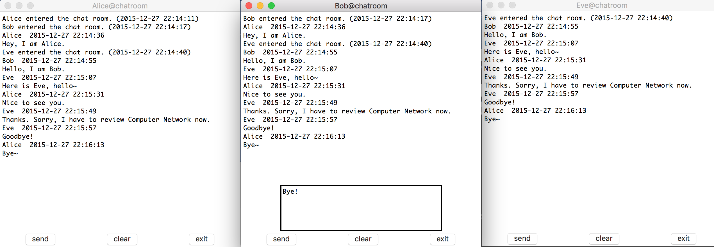
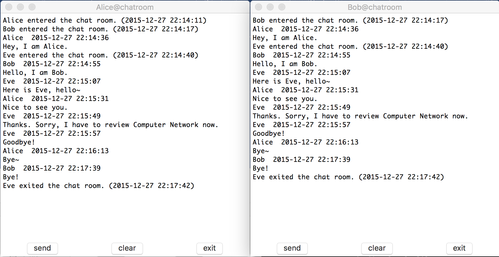

## Chatroom

[Chatroom](https://github.com/irmowan/Chatroom)是一个基于Socket的可视化聊天室基本实现，实现了自定义的协议。是计算机网络课程的课程项目。

语言：Python 2.7

### 使用说明

程序使用python2.7编写，无需任何第三方包，均为python内置包。

UI使用内置的Tkinter包编写。

#### Server

首先运行Server服务端。Server默认运行在localhost:5000上。运行程序后会自动创建socket，并监听端口。

``` shell
>>> python server.py
Socket created.
Socket listening...
```

#### Client

Server运行后，可以运行Client客户端，客户端需要连接到相应的地址和端口。输入自己的用户名后，客户端创建连接，返回连接状态。若失败则自动退出程序。

``` shell
>>> python client.py localhost 5001
Please enter your name: irmo
Connection failed.
```

``` 
>>> python client.py localhost 5000
Please enter your name: irmo
Connection succeeded.
```

连接成功后，一个可视化的聊天室窗口生成。

聊天室窗口有一个聊天文本框，和一个输入文本框，类似QQ等即时聊天工具，包含了Send, Clear, Exit 三种基本的操作。

收到相应协议包后，Server和Client各自的终端会输出原始的协议信息，而Client的聊天文本框会展示解析后的聊天内容。

### Demo

三人进行聊天：



中途，Eve退出了聊天：



### 协议说明

协议实现：[protocol.py](https://github.com/irmowan/Chatroom/blob/master/src/protocol.py)

class: Protocol

本协议的制定参考HTTP的请求协议，无连接、无状态，且无需响应。

协议包括了三部分：[请求行|头部行|数据实体]，各部分分行。

大致框架如下：

``` 
Protocol协议标识 | URI | 请求方法
头部字段名 | 字段值
......
头部字段名 | 字段值
数据实体
```

#### 请求行

请求行分为三部分：协议标识，请求的URI，以及请求方法。例如：

| 请求行  |   协议标识   |     请求的URI     |      请求方法      |
| :--: | :------: | :------------: | :------------: |
|  内容  | Protocol | localhost:5000 | SEND/SYST/EXIT |

其中，实现了这些基本方法：

| 方法   | 含义                              |
| ---- | ------------------------------- |
| SEND | 用于Client发送消息给Server，或Server广播消息 |
| SYST | 用于Server广播系统消息，发送者是Admin        |
| EXIT | 用于Client发送消息给Server，请求退出聊天室     |

请求行直接作为协议主类的一部分。

#### 头部行

Class: Header

头部行用于实现一些请求的参数，使用键值对方式保存。

实现的头部行参数有：

| 参数      | 含义         | 使用             |
| ------- | ---------- | -------------- |
| time    | 发送的时间戳     | Client展示在聊天消息上 |
| name    | 发送者名称      | 用于server匹配发送者  |
| datalen | 数据实体部分的总长度 | 检测数据长度         |

头部行的实例作为协议实例的一部分内容。

#### 数据实体

Class: DataEntity

数据实体保存了实际数据。只有SEND请求方法的这一部分非空，其它请求方法的数据实体部分为空。数据实体的实例作为协议实例的一部分内容。

#### 协议示例

##### SEND方法

Alice发送了一条消息，服务端接受到了它的协议包。

``` 
Protocol localhost:5000 SEND
datalen: 16
name: Alice
time: 1451225731.82
Nice to see you.
```

##### SYST方法

Eve进入了聊天室，服务端广播了一条系统消息。

``` &#39;
Protocol localhost:5000 SYST
datalen: 26
name: Admin
time: 1451225680.16
Eve entered the chat room.
```

##### EXIT方法

Bob退出了聊天室，服务端收到了它的退出请求。

``` 
Protocol localhost:5000 EXIT
datalen: 0
name: Bob
time: 1451225995.55
```

##### 实例

以上面的Demo为例，此处的Server收到的包如下：（包含了SEND和EXIT两种请求方法）

``` 
python src/server.py
Socket created.
Socket listening...
New connection from Alice(127.0.0.1:52475).
New connection from Bob(127.0.0.1:52476).
Protocol localhost:5000 SEND
datalen: 16
name: Alice
time: 1451225676.79
Hey, I am Alice.

New connection from Eve(127.0.0.1:52478).
Protocol localhost:5000 SEND
datalen: 16
name: Bob
time: 1451225695.33
Hello, I am Bob.

Protocol localhost:5000 SEND
datalen: 19
name: Eve
time: 1451225707.32
Here is Eve, hello~

Protocol localhost:5000 SEND
datalen: 16
name: Alice
time: 1451225731.82
Nice to see you.

Protocol localhost:5000 SEND
datalen: 53
name: Eve
time: 1451225749.15
Thanks. Sorry, I have to review Computer Network now.

Protocol localhost:5000 SEND
datalen: 8
name: Eve
time: 1451225757.77
Goodbye!

Protocol localhost:5000 SEND
datalen: 4
name: Alice
time: 1451225773.54
Bye~

Protocol localhost:5000 SEND
datalen: 4
name: Bob
time: 1451225859.43
Bye!

Protocol localhost:5000 EXIT
datalen: 0
name: Eve
time: 1451225862.79


Connection with Eve(127.0.0.1:52478) ended.
Protocol localhost:5000 EXIT
datalen: 0
name: Bob
time: 1451225995.55


Connection with Bob(127.0.0.1:52476) ended.
Protocol localhost:5000 EXIT
datalen: 0
name: Alice
time: 1451226233.16


Connection with Alice(127.0.0.1:52475) ended.
^CServer shutdown.
```

Bob客户端得到的包如下：（包含了SEND和SYST两种请求方法）

``` 
>>> python client.py locaolhost 5000
Please enter your name: Bob
Connection succeeded.
Protocol localhost:5000 SYST
datalen: 26
name: Admin
time: 1451225657.87
Bob entered the chat room.

Protocol localhost:5000 SEND
datalen: 16
name: Alice
time: 1451225676.79
Hey, I am Alice.

Protocol localhost:5000 SYST
datalen: 26
name: Admin
time: 1451225680.16
Eve entered the chat room.

Protocol localhost:5000 SEND
datalen: 16
name: Bob
time: 1451225695.33
Hello, I am Bob.

Protocol localhost:5000 SEND
datalen: 19
name: Eve
time: 1451225707.32
Here is Eve, hello~

Protocol localhost:5000 SEND
datalen: 16
name: Alice
time: 1451225731.82
Nice to see you.

Protocol localhost:5000 SEND
datalen: 53
name: Eve
time: 1451225749.15
Thanks. Sorry, I have to review Computer Network now.

Protocol localhost:5000 SEND
datalen: 8
name: Eve
time: 1451225757.77
Goodbye!

Protocol localhost:5000 SEND
datalen: 4
name: Alice
time: 1451225773.54
Bye~

Protocol localhost:5000 SEND
datalen: 4
name: Bob
time: 1451225859.43
Bye!

Protocol localhost:5000 SYST
datalen: 25
name: Admin
time: 1451225862.79
Eve exited the chat room.
```

#### 代码说明

##### Protocol.py

- class Protocol()
  
  实现了Protocol主类，实例化Header和DataEntity为其成员。
  
  `set_version`, `set_uri`, `set_type`设置请求行属性。


- class Header()
  
  实现了Protocol头部行，`set_time`, `set_name`, `set_datalen`设置头部行属性。`pack`, `unpack`对头部行进行打包、解析包。


- class DataEntity()
  
  实现了Protocol数据实体，`set_data`设置数据属性，`pack`, `unpack`进行数据实体的打包、解析。
  
- class Request()
  
  继承自Protocol，表示一个请求。
  
  提供了`pack`, `unpack`打包和解析请求的函数，提供`generate`函数由给定参数设置协议的各部分。提供一些`get`方法获得Protocol的属性
  
- function `read_time()`
  
  将时间戳转换为标准时间格式
  
- function `generateRequest()`
  
  实例化一个Request并打包，返回相应的字符串。
  
- function `handleRequest()`
  
  解析一个字符串，获得一个Request类。

##### Server.py

包含一个ChatServer类。该类继承自socket类，含有以下方法：

- `__init__`
  
  建立Socket连接，监听端口。
  
- `handle_accept`
  
  监听端口信息，每当收到一个新的连接请求时，创建新线程执行`handle_single_connect`以服务该客户端。
  
- `handle_single_connect`
  
  接受某个客户端信息。
  
  首先将收到的用户名称加入在线用户列表中，并广播发送系统消息(新用户进入了聊天室)。
  
  每当收到一个新的协议包，终端输出原始的协议包。
  
  根据协议包的类型执行操作。若是SEND请求，广播发送协议包。若是EXIT请求，从在线列表中删除，并广播发送系统消息(某用户退出了聊天室)。
  
- `broadcast`
  
  向在线列表中的每个用户广播发送消息。

在主函数中，创建ChatServer实例，当监听到KeyboardInterrupt时，退出Server。

##### Client.py

包含了一个ChatFrame类，继承自Tkinter.Frame，设计UI及其逻辑。

- `__init__`
  
  新建控件，调用`__create_widgets`进行布局。
  
  创建新线程执行`__receive_message`用于接收消息。
  
  向Server发送用户名。
  
- `__create_widgets`
  
  控件布局
  
- `__send`
  
  在点击send按钮时触发。
  
  获得文本框中文本，若非空，则打包文本，发送一个SEND请求。
  
- `__clear`
  
  在点击clear按钮时触发。
  
  清空聊天文本框。
  
- `__receive_message`
  
  监听收到的消息。
  
  收到新协议包时，终端输出原始协议包。
  
  根据协议包的类型进行操作。若为SEND，则解析包中的用户名，时间，消息等数据，输出一条聊天记录。若为SYST，则表示是一条系统消息，同样，以一定格式输出系统消息。
  
- `__exit`
  
  在点击exit按钮时触发。
  
  生成协议包，发送一个EXIT请求，并关闭socket，退出程序。

此外，还有一个ChatClient类，继承自socket类，封装了简单的socket逻辑，包括`connect`, `close`, `receive`, `sendall`。

主函数中，设置一些程序常数，请求用户输入用户名，并创建ChatClient实例，建立连接，返回连接状态信息。连接建立好后，生成图形界面供用户操作。


Author: [irmo](https://github.com/irmowan)

Date: 2015.12

